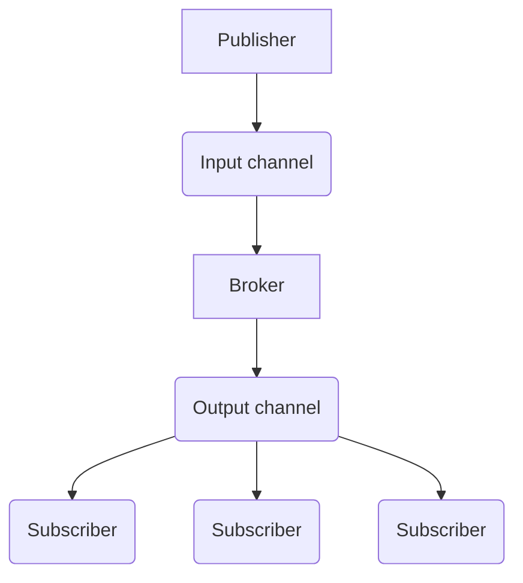

# A look at using various Azure services for messaging

# Asynchronous
## Pub/Sub

Azure Service Bus
- [Local Development](https://jimmybogard.com/local-development-with-azure-service-bus/)

### Topics
Each topic has a dedicated output channel, and a consumer can subscribe to relevant topics

### Content Filtering
Each subscriber can specify the type of content it's interested in

## Queues